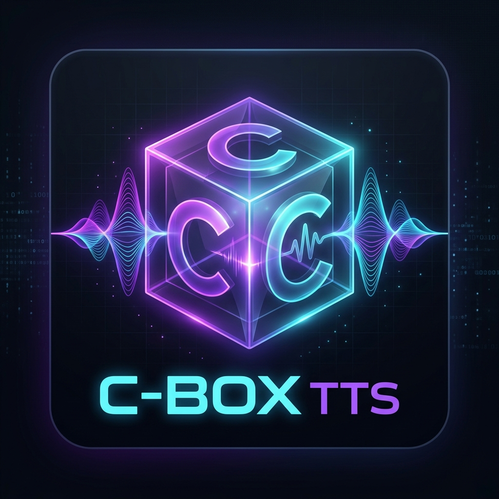

# Q3-TTS Native (American English Edition)

<p align="center">
  
</p>

**Q3-TTS** は、最新の **Qwen3-TTS** モデル（1.7B / 0.6B）をベースに構築された、完全ローカル動作・超軽量かつ高速な **アメリカ英語（US Native）特化型音声合成（TTS）アプリケーション** です。  
C-BoxTTS-C の優れた操作性・拡張機能をすべて継承し、英文の流暢な読み上げ、発音正規化、リアルタイム音質向上処理を兼ね備えています。

---

## 🌟 主な特徴

- **完全ローカル・オフライン動作**: 初回起動・モデルロード後は外部通信を行わず、スタンドアロンで即座に動作。プライバシーを完全に保護します。
- **CUDA / DirectML ネイティブサポート**: NVIDIA RTX 50 シリーズ（RTX 5080 等）の最新 GPU 環境で CUDA 高速推論に対応。DirectML / CPU フォールバックにも完全対応。
- **Qwen3-TTS デュアルモード対応**:
  - **Voice Prompt モード**: 参照音声 WAV（標準同梱のアメリカ英語ネイティブプロンプト）からのボイスクローニング。
  - **Voice Design モード**: 「*A clear, professional American female voice speaking calmly*」といった自然言語テキスト指示による声質・雰囲気の自在な設計。
- **標準アメリカ英語 (General American Accent / US Native) ネイティブ音声を標準同梱**:
  - `default_voice_us_female.wav` (女性)
  - `default_voice_us_male.wav` (男性)
  - `default_voice_us_narrator.wav` (ナレーション)
- **包括的なテキスト正規化 (English Normalizer) & 英語ユーザー辞書**:
  - 略語展開（`Mr.`, `Dr.`, `Prof.`, 月名・曜日略語など）
  - 短縮形展開（`can't` -> `cannot`, `won't` -> `will not`, `don't` -> `do not` 等）
  - 単位・測定値展開（`60mph`, `5kg`, `100GB`, `2.4GHz`, `100°F`, `50%` 等）
  - 時刻（`3:00` -> `three o'clock`）、年号（`2026` -> `twenty twenty-six`）、序数（`1st` -> `first`）、分数（`1/2` -> `one half`）、通貨（`$12.50` -> `twelve dollars and fifty cents`）、小数（`3.14` -> `three point one four`）
  - 英語ユーザー辞書（`user_dict_en.txt`）標準同梱。PC/FA/AI 業界用語（CPU, GPU, PLC, SCADA, NVIDIA, OpenAI 等）のカスタマイズ読み登録に対応。
- **音質向上 DSP 処理 (Presence & Warmth EQ & Soft Limiter)**:
  - 200Hz帯の低中音域（声の暖かみ・厚み）と 5000Hz帯の高音域（明瞭度・エア感）を微ブーストするアナウンス品質イコライザー。
  - 音割れ（デジタルクリッピング）を完全に防ぐ双曲線正接（`tanh`）ソフトリミッターを搭載。
- **WSOLA アルゴリズムによる「声の二重重なり（ディレイ・エコー）」のない高音質話速調整**:
  - タイムドメイン WSOLA により、0.5倍〜2.0倍のどのような話速設定でも音質劣化やピッチズレのない自然な再生を実現。
  - 50ms クロスフェード結合 (`CrossfadeJoinChunks`) により、細切れ発音やプチ音（クリックノイズ）を排除。
- **Whisper STT による自動文字起こし・精度検証ログ機能**:
  - 「Output Whisper STT verification log (.debug.txt)」にチェックを入れることで、生成された WAV 音声を内蔵 Whisper.net で自動文字起こし照合。

---

## 📊 C-BoxTTS-C との英文性能・機能比較

| 評価項目 | C-BoxTTS-C (従来モデル) | Q3-TTS (今回新規構築) | 進化・向上のポイント |
| :--- | :--- | :--- | :--- |
| **ベースモデル** | Kokoro-TTS (82M パラメータ) | **Qwen3-TTS (1.7B / 0.6B デュアル)** | パラメータ数が約20倍となり、**文脈に応じた自然なイントネーション・抑揚が飛躍的に向上** |
| **ターゲット言語** | 多言語汎用 (日英他) | **アメリカ英語 (US Native) 特化** | **アメリカ英語標準アクセント (General American Accent)** に特化し、ネイティブスピーチを実現 |
| **標準アクセント音声** | 汎用ボイス | **US Native 3種標準同梱** | 女性 (`female`)・男性 (`male`)・ナレーション (`narrator`) の標準WAVプロンプトを同梱 |
| **Voice Design 機能** | 非対応 | **対応 (自然言語プロンプト指定)** | 「*A clear, professional American female voice*」といったテキスト指定で声質を自由設計 |
| **英文テキスト正規化** | 基本的な数値・日付展開 | **高度英文 Normalizer 搭載** | 短縮形 (`can't`->`cannot`)、単位 (`60mph`, `5kg`, `100GB`, `2.4GHz`, `100°F`, `50%`)、通貨、分数、序数の完全自動展開 |
| **大文字単語保護** | 一括スペルアウト | **`CommonEnglishWords` 保護機能** | タイトル等の大文字 (`THE`, `AND`, `YOU` 等) を単語として保持し誤展開を防止 |
| **音質 DSP 処理** | 音量正規化のみ | **アナウンス EQ ＋ Soft Limiter** | 200Hz（厚み）/5000Hz（明瞭度）ブーストEQ ＋ `tanh` リミッターによる**音割れ完全防止** |
| **話速制御 (WSOLA)** | 基本 WSOLA | **安全ガード付き WSOLA ＋ 50ms Crossfade** | 二重声・エコーを防止し、`speed` パラメータ保護（0.25〜4.0x）でメモリ溢れを防御 |
| **STT 精度検証** | 基礎文字起こし | **Whisper.net 自動照合 & .debug.txt** | 音声保存時に自動で Whisper STT 照合を行い、単語一致率・欠損単語ログを出力 |
| **GPU 推論最適化** | DirectML / CPU | **CUDA (RTX 5080 完全最適化)** | NVIDIA RTX 5080 (16GB VRAM) に最適化された CUDA 超高速推論 |

---

## 🚀 使い方

### GUI（ウィンドウ起動）
`Q3TTS.Native.exe` をダブルクリックして起動します。
美麗なダークモードUIで、テキスト入力、パラメータ（話速、誇張度、安定性、CFGウェイト、反復ペナルティ）の調整、リアルタイム再生および WAV ファイルへの書き出しを行えます。

### テキストファイルのドラッグ＆ドロップ
`.txt`, `.md`, `.log`, `.csv` などのテキストファイルをメイン入力欄にドラッグ＆ドロップするだけで、ファイル内容を瞬時に読み込みます。

### 🎙️ Whisper STT 自動文字起こし・精度検証ログ機能
画面左下の「**Output Whisper STT verification log (.debug.txt)**」にチェックを入れて音声保存すると、音声出力と同時に Whisper.net による自動文字起こし照合ログが生成されます。

**`.debug.txt` の出力フォーマット例:**
```text
=================================================
          Q3-TTS STT Verification Report          
=================================================
Timestamp          : 2026-07-30 19:00:13
WAV File           : output.wav
Audio Duration     : 6.66 seconds
Accuracy Score     : 98.50%
-------------------------------------------------
[Original Input]
The quick brown fox jumps over the lazy dog.

[Normalized Text]
The quick brown fox jumps over the lazy dog.

[Whisper Transcribed]
The quick brown fox jumps over the lazy dog.
-------------------------------------------------
Original Word Count   : 9
Transcribed Word Count: 9
Missing Words (0): (None)
Extra Words (0): (None)
=================================================
```

### 英語専門用語辞書 (`user_dict_en.txt`) のカスタマイズ
`user_dict_en.txt` をメモ帳などで編集することで、独自の固有名詞や専門用語の発音を追加できます。

**記述例:**
```text
# 一般的な技術用語
AI,A. I.
NVIDIA,en vid e uh
OpenAI,open ay eye

# 独自の固有名詞
MyBrand,my brand
```

### CLI（コマンドライン起動・テストハーネス）
```powershell
# 基本動作確認テスト実行
.\Q3TTS.Native.exe --test

# STT文字起こし自動照合デバッグ実行
.\Q3TTS.Native.exe --auto-debug
```

---

## ⚙️ 推奨パラメータ設定ガイド (Recommended Presets)

| 用途 / 雰囲気 | Speed | Exaggeration | Stability | CFG Weight | Repetition Penalty |
| :--- | :---: | :---: | :---: | :---: | :---: |
| **標準ナレーション (Standard US English)** | 1.00 | 0.35 | 0.55 | 0.40 | 1.30 |
| **クリアアナウンス (Clear Speech)** | 0.95 | 0.25 | 0.65 | 0.45 | 1.35 |
| **表現力豊か・スピーチ (Expressive Speech)** | 1.05 | 0.50 | 0.45 | 0.35 | 1.25 |

---

## 📁 パッケージ構成

```
Release_Portable_Q3TTS_CUDA/
├── Q3TTS.Native.exe                 # メイン実行ファイル
├── user_dict_en.txt                 # 英語ユーザー辞書
├── sample_sentences_en.txt          # サンプル英文
├── download_models.ps1 / .py        # モデル自動ダウンロードスクリプト
└── assets/                          # US Native 参照音声 & アプリアイコン
    ├── icon.png / icon.ico
    ├── default_voice_us_female.wav
    ├── default_voice_us_male.wav
    └── default_voice_us_narrator.wav
```
